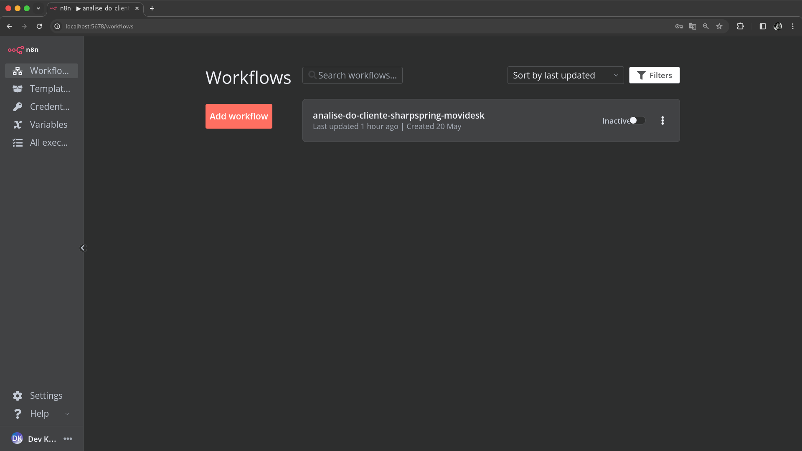

# KAMI N8N Workflows [PT](README.md) | [EN](README-en_us.md)

## Summary

1. [**Introduction**](#introduction)
2. [**Project Objective and Scope**](#project-objective-and-scope)
3. [**Development Road Map Methodology**](#development-road-map-methodology)
4. [**Getting Started with N8N**](#getting-started-with-n8n)
5. **Workflows by Area of Interest**
    - [**CRM**](./modules/crm/readme.md)
6. [**API Documentation References**](#api-documentation-references)
7. [**Bibliographical References**](#bibliographical-references)

## Introduction

This document provides a comprehensive guide for non-developer users to import, configure, test, and activate various workflows in an N8N instance. These workflows integrate multiple platforms to automate processes across different sectors of the company.

## Project Objective and Scope

The primary objective of this project is to create an automation hub for the company, utilizing N8N to streamline and automate workflows across various departments. This will enhance efficiency, reduce manual tasks, and ensure seamless integration between different platforms.

## Development Road Map Methodology

Using N8N as an RPA automation server offers several advantages in a dynamic business environment:

- **Flexibility:** N8N allows for easy integration with various APIs and services, making it adaptable to changing business needs.
- **User-Friendly Interface:** The visual workflow builder in N8N is intuitive, enabling users with minimal technical knowledge to create and manage complex workflows.
- **Scalability:** N8N can scale horizontally, supporting high volumes of data and complex automation processes.
- **Open Source:** As an open-source platform, N8N provides transparency and the ability to customize the source code as needed.
- **Community Support:** A robust community offers extensive resources, plugins, and support, facilitating quick problem resolution.

However, users should be mindful of:

- **Security:** Ensure all credentials and sensitive data are handled securely.
- **Performance:** Monitor workflow performance to avoid bottlenecks and ensure efficient execution.
- **Maintenance:** Regularly update the N8N instance and workflows to incorporate new features and security patches.

## Getting Started with N8N

### Accessing N8N

1. **Log in to your N8N instance.**

    
    *Caption: N8N login screen.*

2. **Navigate to the N8N dashboard.**

    
    *Caption: N8N dashboard view.*

### Basic Workflow Management Operations

- **Creating a Workflow:**
  1. Click on 'New' to create a new workflow.
  2. Drag and drop nodes from the left panel to build your workflow.

    
    *Caption: Creating a new workflow in N8N.*

- **Importing a Workflow:**
  1. Navigate to the 'Workflows' section and click on 'Import.'
  2. Upload your workflow JSON file.

    
    *Caption: Importing a workflow in N8N.*

- **Running a Workflow:**
  1. Open the workflow you want to run.
  2. Click on 'Execute Workflow' to start it manually.

    
    *Caption: Running a workflow in N8N.*

- **Setting Up Environment Variables:**
  1. Locate and Open the 'env-vars' node in your workflow.
  2. Update the API credentials and other necessary variables.

    
    *Caption: Open `env-vars` Node.*

    
    *Caption: Setting up environment variables.*

- **Monitoring Workflow Execution:**
  1. Go to the 'Executions' section to monitor workflow runs.
  2. Review logs and outputs to ensure everything is running smoothly.

    
    *Caption: Monitoring workflow execution.*

For more detailed information, refer to the [N8N Documentation](https://docs.n8n.io/).

### API Documentation References

- [SharpSpring API Documentation](https://api.sharpspring.com/)
- [Movidesk API Documentation](https://api.movidesk.com/public/v1)

### Bibliographical References

- SharpSpring. (2024). *SharpSpring API Documentation*. Retrieved from [SharpSpring API](https://api.sharpspring.com/)
- Movidesk. (2024). *Movidesk API Documentation*. Retrieved from [Movidesk API](https://api.movidesk.com/public/v1)

---
