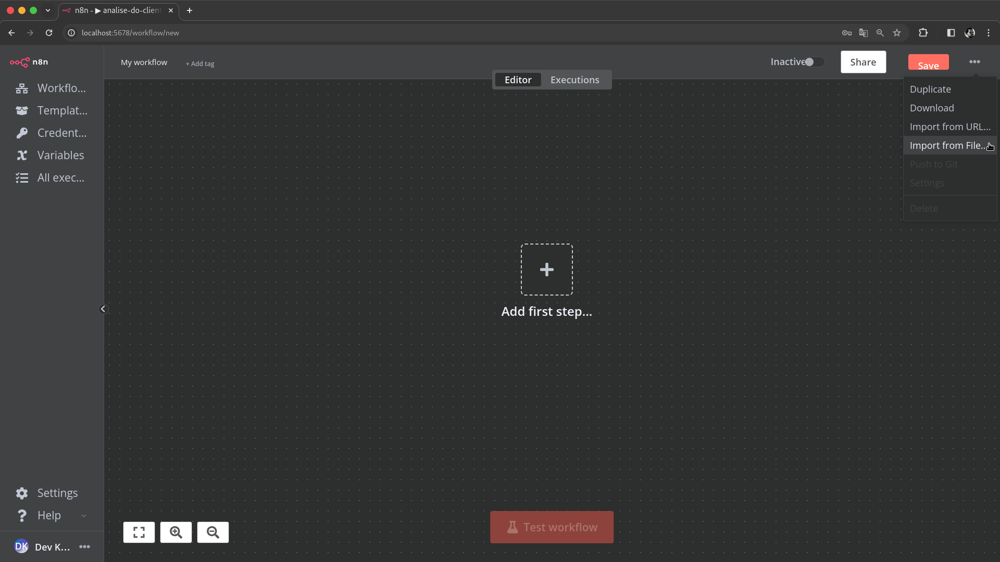
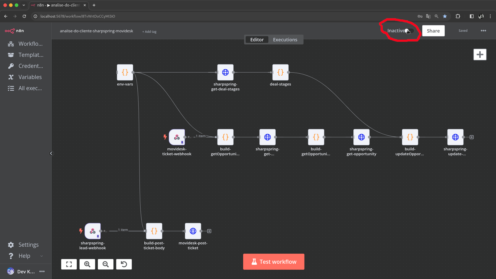
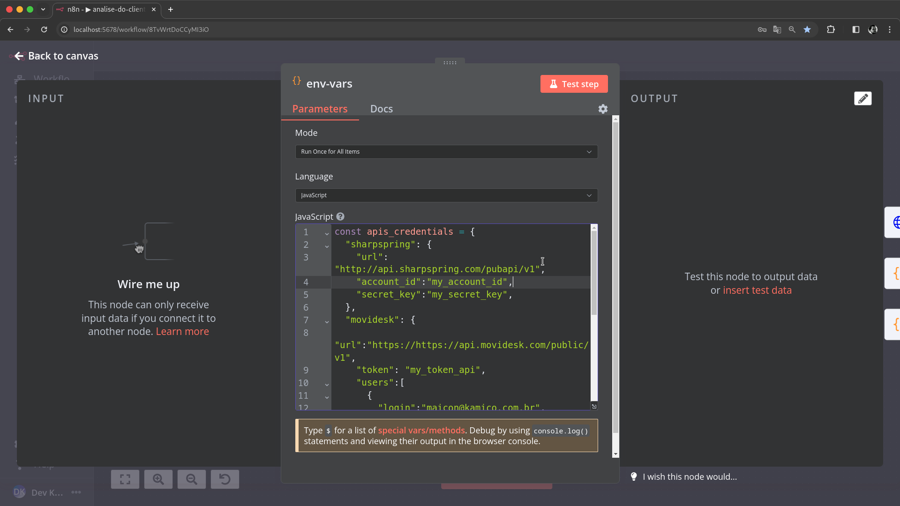
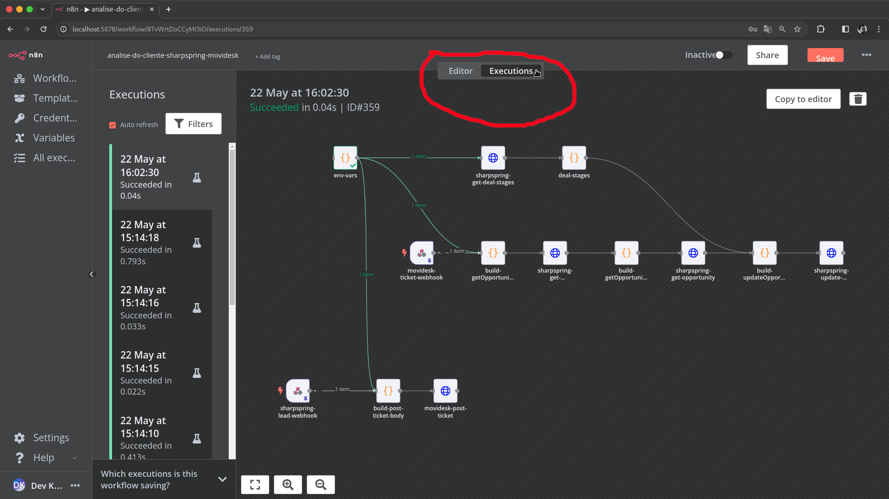

# KAMI N8N Workflows [PT](README.md) | EN

## Summary

1. [**Introduction**](#introduction)
2. [**Project Objective and Scope**](#project-objective-and-scope)
3. [**Development Road Map Methodology**](#development-road-map-methodology)
4. [**Getting Started with N8N**](#getting-started-with-n8n)
5. **Workflows by Area of Interest**
    - [**CRM**](./modules/crm/main.md)
    - [**E-Comm**](./modules/ecomm/main.md)
6. [**References**](#references)

## Introduction

This document provides a comprehensive guide for non-developer users to import, configure, test, and enable various task automations on an N8N instance. These automations integrate multiple platforms, increasing the productivity of processes in different sectors of the company.

## Project Objective and Scope

The main objective of this project is to create an automation hub for the company, using N8N to streamline and automate tasks in various departments. This will increase efficiency, reduce manual tasks and ensure seamless integration between different platforms.

## Development Road Map Methodology

### How sausages are made ?

Utilizing Domain-Driven Design (DDD) concepts, the project is structured to reflect real business domains. The creative process will also be documented to include the process that made it possible. This will be detailed in specific documents as listed below:

- **Functional Requirements:** This document contains the summary of meetings held with business experts and end users to extract the functional requirements that the solution needs to deliver, providing a clear vision of the expected functionalities. [Find out more...](./requirements_analysis.md)
- **Gen A.I. Prompts:** Includes the prompts used in ChatGPT-4 to assist in the development of the project, detailing the interactions and results obtained. [Find out more...](./prompts-gpt.md)
- **Logbook:** Entries summarized by day and time describing the evolution of the project and the challenges faced. [Find out more...](./logbook.md)

### But why the heck N8N ?

Using N8N as an RPA automation server offers several advantages in a dynamic business environment:

- **Flexibility:** N8N allows for easy integration with various APIs and services, making it adaptable to changing business needs.
- **User-Friendly Interface:** The visual workflow builder in N8N is intuitive, enabling users with minimal technical knowledge to create and manage complex workflows.
- **Scalability:** N8N can scale horizontally, supporting high volumes of data and complex automation processes.
- **Open Source:** As an open-source platform, N8N provides transparency and the ability to customize the source code as needed.
- **Community Support:** A robust community offers extensive resources, plugins, and support, facilitating quick problem resolution.

However, users should be mindful of:

- **Security:** Ensure all credentials and sensitive data are handled securely.
- **Performance:** Monitor workflow performance to avoid bottlenecks and ensure efficient execution.
- **Maintenance:** Regularly update the N8N instance and workflows to incorporate new features and security patches.

### Getting Started with N8N

N8N is an extendable workflow automation tool that enables you to connect various applications and automate repetitive tasks. It allows you to create workflows through a user-friendly interface, which integrates different services and APIs without writing code. N8N provides a powerful automation engine, making it suitable for a wide range of business automation needs.

#### Workflows

In the context of N8N, a workflow is a series of automated tasks that are triggered by certain events or conditions. Each workflow can contain multiple nodes, where each node represents a specific task or operation, such as sending an email, making an API request, or processing data. By linking these nodes together, you can create complex automation sequences that streamline your business processes. This concept aligns with the automated tasks described in this document, where workflows are used to integrate and automate different platforms and services, enhancing efficiency and reducing manual effort.

### Accessing N8N

1. **Log in to your N8N instance.**

      
      *Caption: N8N login screen.*

2. **N8N Home Screen.**

      
      *Caption: N8N Panel.*

### Basic workflow management operations

- **Creating a Workflow:**
     1. Click 'Add Workflows' to create a new workflow.

     
      *Caption: Creating a new workflow in N8N.*

     1. Click the '+' button to add a new node.

     
      *Caption: Creating a new node in the workflow.*

- **Importing a Workflow from a JSON file:**
     1. Create a new workflow as in the previous section
     2. In the '...' button on the right corner select 'Import from file...'
     3. Upload your workflow JSON file.

     
      *Caption: Importing a workflow into N8N.*

- **Activating a workflow:**
     1. Open the workflow you want to activate.
     2. Drag the 'inactive' switch button in the top right corner to activate.

     
      *Caption: Running a workflow on N8N.*

- **Setting environment variables:**
  
    Some workflows in this project have a node called '*__env-vars__*' used to configure some important and/or sensitive information, such as API credentials, tokens, logins and passwords, to configure just follow the following tutorial:

     1. Find and open the ‘env-vars’ node in your workflow.
     2. Update API credentials and other possible variables.

     
      *Caption: Opening the `env-vars` node.*

     
      *Caption: Setting up environment variables.*

- **Monitoring Workflow Execution:**
  1. Go to the 'Executions' section to monitor workflow runs.
  2. Review logs and outputs to ensure everything is running smoothly.

    
    *Caption: Monitoring workflow execution.*

### References

#### Books

Evans, E. (2003). *Domain-Driven Design: Tackling Complexity in the Heart of Software*. Addison-Wesley.

#### API Documentation

SharpSpring. (2024). *SharpSpring API Documentation*. Retrieved from [https://api.sharpspring.com/](https://api.sharpspring.com/)

Movidesk. (2024). *Movidesk API Documentation*. Retrieved from [https://api.movidesk.com/public/v1](https://api.movidesk.com/public/v1)

#### Applications Documentantion

N8N. (2024). *N8N Documentation*. Retrieved from [https://docs.n8n.io/](https://docs.n8n.io/)

---
