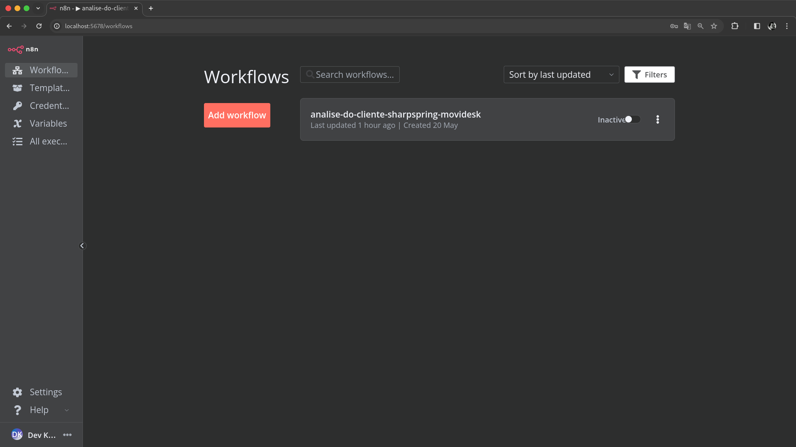
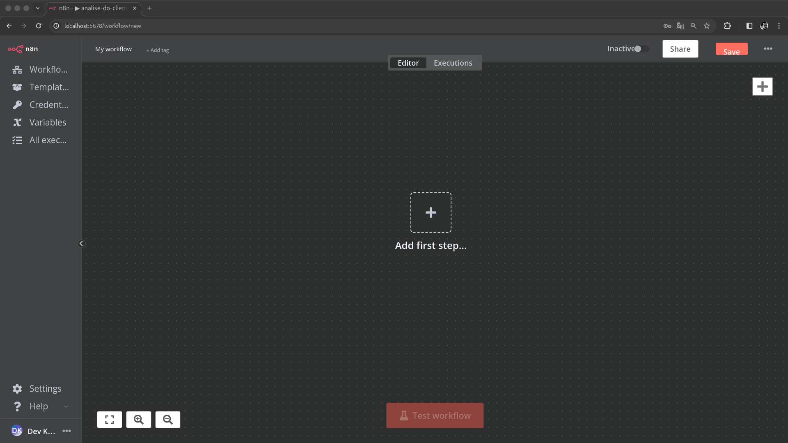
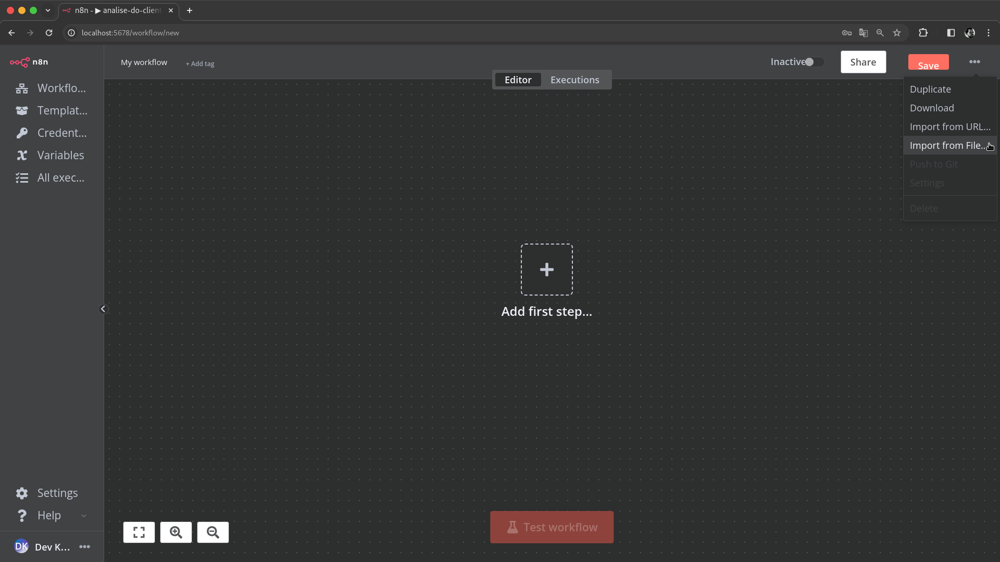
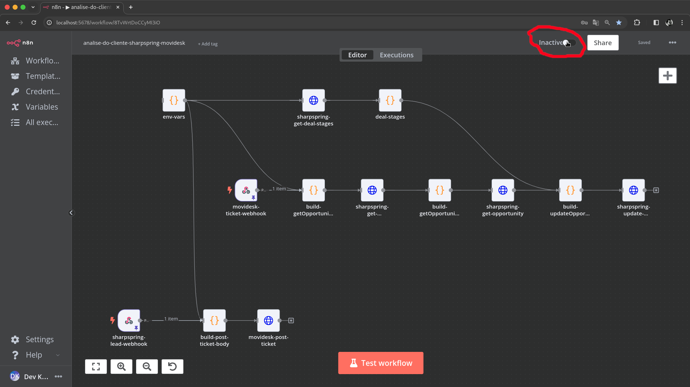
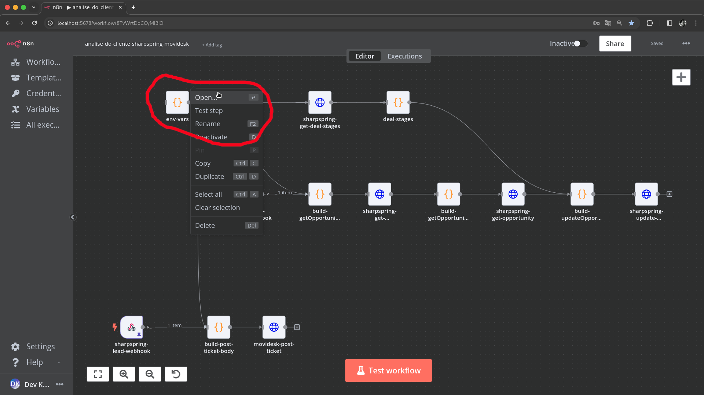
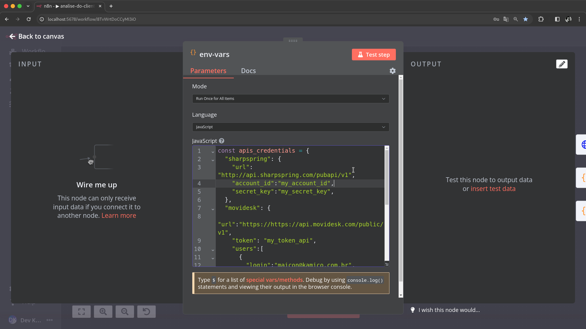
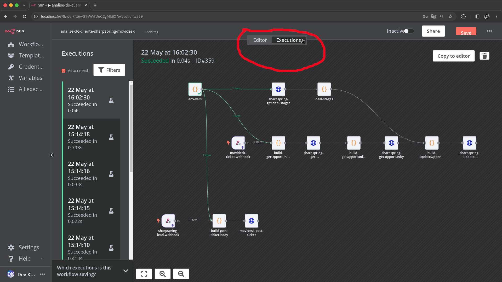

# KAMI N8N Workflows [PT](README.md) | [EN](README-en_us.md)

## Sumário

1. [**Introdução**](#introdução)
2. [**Objetivo e Escopo do Projeto**](#objetivo-e-escopo-do-projeto)
3. [**Metodologia do Roteiro de Desenvolvimento**](#metodologia-do-roteiro-de-desenvolvimento)
4. [**Primeiros passos com N8N**](#primeiros-passos-com-n8n)
5. **Workflows por Area de Interesse**
    - [**CRM**](./modules/crm/readme.md)
6. [**Referências de documentação da API**](#referências-de-documentação-da-api)
7. [**Referências Bibliográficas**](#referências-bibliográficas)

## Introdução

Este documento fornece um guia abrangente para usuários não desenvolvedores importar, configurar, testar e ativar vários fluxos de trabalho em uma instância N8N. Esses fluxos de trabalho integram múltiplas plataformas para automatizar processos em diferentes setores da empresa.

## Objetivo e Escopo do Projeto

O objetivo principal deste projeto é criar um hub de automação para a empresa, utilizando N8N para agilizar e automatizar fluxos de trabalho em vários departamentos. Isto aumentará a eficiência, reduzirá tarefas manuais e garantirá uma integração perfeita entre diferentes plataformas.

## Metodologia do Roteiro de Desenvolvimento

Usar o N8N como servidor de automação RPA oferece diversas vantagens em um ambiente de negócios dinâmico:

- **Flexibilidade:** O N8N permite fácil integração com diversas APIs e serviços, tornando-o adaptável às mudanças nas necessidades de negócios.
- **Interface amigável:** O construtor visual de fluxo de trabalho no N8N é intuitivo, permitindo que usuários com conhecimento técnico mínimo criem e gerenciem fluxos de trabalho complexos.
- **Escalabilidade:** O N8N pode ser dimensionado horizontalmente, suportando grandes volumes de dados e processos de automação complexos.
- **Código aberto:** Como plataforma de código aberto, o N8N oferece transparência e a capacidade de personalizar o código-fonte conforme necessário.
- **Suporte da comunidade:** Uma comunidade robusta oferece amplos recursos, plug-ins e suporte, facilitando a resolução rápida de problemas.

No entanto, os usuários devem estar atentos a:

- **Segurança:** Garanta que todas as credenciais e dados confidenciais sejam tratados com segurança.
- **Desempenho:** Monitore o desempenho do fluxo de trabalho para evitar gargalos e garantir uma execução eficiente.
- **Manutenção:** Atualize regularmente a instância N8N e os fluxos de trabalho para incorporar novos recursos e patches de segurança.

## Primeiros passos com N8N

### Acessando N8N

1. **Faça login em sua instância N8N.**

    
    *Caption: N8N tela de login.*

2. **Navegue até o painel do N8N.**

    
    *Caption: Painel do N8N.*

### Operações básicas de gerenciamento de fluxo de trabalho

- **Criando um fluxo de trabalho:**
   1. Clique em 'Novo' para criar um novo fluxo de trabalho.
   2. Arraste e solte nós do painel esquerdo para criar seu fluxo de trabalho.

    
    *Caption: Creating a new workflow in N8N.*

- **Importando um fluxo de trabalho:**
   1. Navegue até a seção ‘Fluxos de trabalho’ e clique em ‘Importar’.
   2. Carregue seu arquivo JSON de fluxo de trabalho.

    
    *Caption: Importing a workflow in N8N.*

- **Executando um fluxo de trabalho:**
   1. Abra o fluxo de trabalho que deseja executar.
   2. Clique em 'Executar Fluxo de Trabalho' para iniciá-lo manualmente.

    
    *Caption: Running a workflow in N8N.*

- **Configurando variáveis de ambiente:**
   1. Localize e abra o nó ‘env-vars’ em seu fluxo de trabalho.
   2. Atualize as credenciais da API e outras variáveis necessárias.

    
    *Caption: Open `env-vars` Node.*

    
    *Caption: Setting up environment variables.*

- **Monitoramento da execução do fluxo de trabalho:**
   1. Vá para a seção 'Execuções' para monitorar as execuções do fluxo de trabalho.
   2. Revise os logs e resultados para garantir que tudo esteja funcionando perfeitamente.

    
    *Caption: Monitoring workflow execution.*

Para informações mais detalhadas, consulte a [Documentação N8N](https://docs.n8n.io/).

### Referências de documentação da API

- [Documentação da API SharpSpring](https://api.sharpspring.com/)
- [Documentação da API Movidesk](https://api.movidesk.com/public/v1)

### Referências Bibliográficas

- Sharp Spring. (2024). *Documentação da API SharpSpring*. Obtido da [API SharpSpring](https://api.sharpspring.com/)
- Movidesk. (2024). *Documentação da API Movidesk*. Obtido da [API Movidesk](https://api.movidesk.com/public/v1)

---
