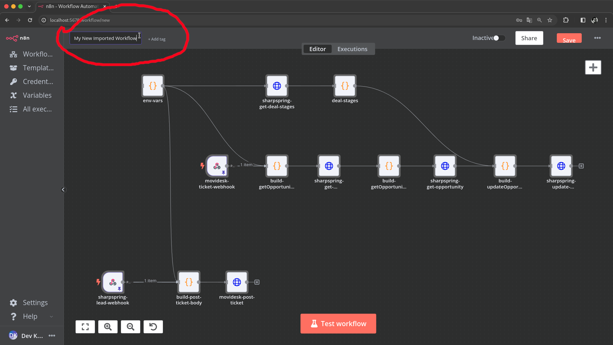
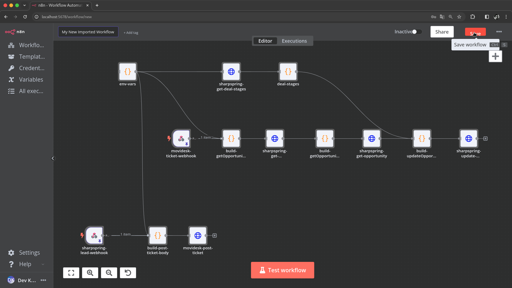
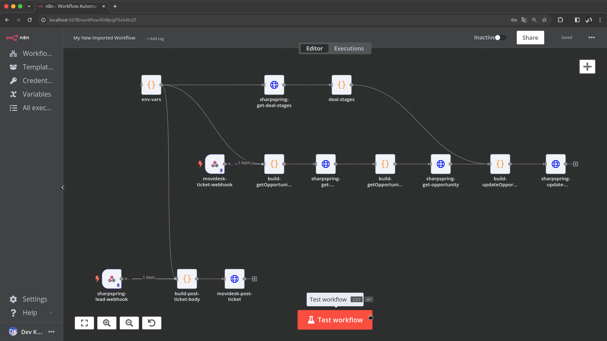

# Client Analysis Workflow [PT](analise_do_cliente_sharpspring_movidesk.md) | [EN](analise_do_cliente_sharpspring_movidesk-en_us.md)

The Client Analysis workflow integrates SharpSpring and Movidesk to automate client analysis processes. this document descrbies how to importing and using the [Client Analisys](../../../modules/crm/analise_do_cliente_sharpspring_movidesk.json) workflow in N8N.

## Importing and Using the Workflow in N8N

### Importing the Workflow

1. **Import** [analise_do_cliente_sharpspring_movidesk.json](../../../modules/crm/analise_do_cliente_sharpspring_movidesk.json) file stored in `modules/crm/` folder in this project as mentioned in [Basic Workflow Management Operations
](../../../README.md#basic-workflow-management-operations) section on this project README.

2. **Name** the workflow as you prefer.

3. **Save** it and then the workflow will appear in your list of workflows.


*Caption: Name Imported Workflow .*


*Caption: Save Imported Workflow.*

### Setting Up Environment Variables

1. **Update** the API credentials for SharpSpring and Movidesk. by edit `env-vars` node as mentioned in [Basic Workflow Management Operations
](../../../README.md#basic-workflow-management-operations) section on this project README.

    ```javascript
    const apis_credentials = {
      "sharpspring": {
        "url": "http://api.sharpspring.com/pubapi/v1",
        "account_id": "your_sharpspring_account_id",
        "secret_key": "your_sharpspring_secret_key",
      },
      "movidesk": {
        "url": "https://api.movidesk.com/public/v1",
        "token": "your_movidesk_token",
      },
    };
    ```

2. **Save the changes.**

### Testing the Workflow

1. Navigate to the workflow settings and **trigger** `test workflow` button.

    
    *Caption: Manually triggering the workflow for testing.*

2. Check the **execution logs** to verify the workflow's behavior as mentioned in [Basic Workflow Management Operations
](../../../README.md#basic-workflow-management-operations) section on this project README.

### Activating the Workflow

After successful testing, switch the workflow to 'Active' mode as mentioned in [Basic Workflow Management Operations
](../../../README.md#basic-workflow-management-operations) section on this project README.

### API Documentation References

- [SharpSpring API Documentation](https://api.sharpspring.com/)
- [Movidesk API Documentation](https://api.movidesk.com/public/v1)

### Bibliographical References

- SharpSpring. (2024). *SharpSpring API Documentation*. Retrieved from [SharpSpring API](https://api.sharpspring.com/)
- Movidesk. (2024). *Movidesk API Documentation*. Retrieved from [Movidesk API](https://api.movidesk.com/public/v1)
