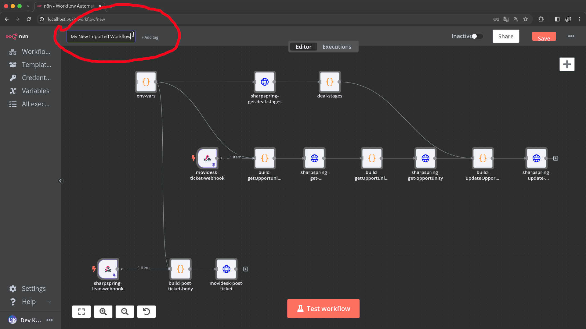
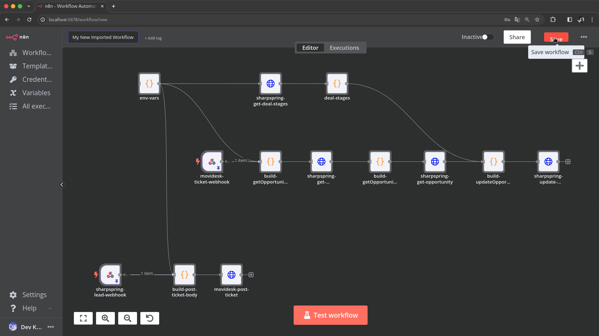
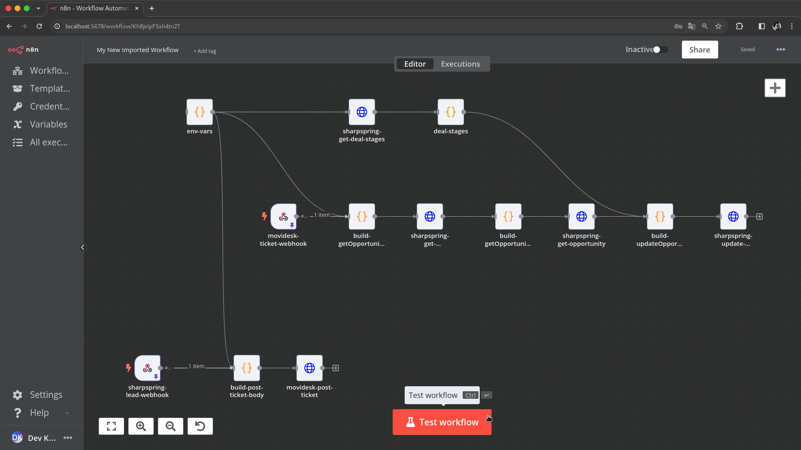

# Workflow de Análise do Cliente [PT](analise_do_cliente_sharpspring_movidesk.md) | [EN](analise_do_cliente_sharpspring_movidesk-en_us.md)

O fluxo de trabalho de Análise de Clientes integra SharpSpring e Movidesk para automatizar processos de análise de clientes. este documento descreve como importar e usar o fluxo de trabalho [Client Analisys](../../../modules/crm/analise_do_cliente_sharpspring_movidesk.json) no N8N.

## Importando e usando o fluxo de trabalho no N8N

### Importando o fluxo de trabalho

1. **Importar** [analise_do_cliente_sharpspring_movidesk.json](../../../modules/crm/analise_do_cliente_sharpspring_movidesk.json) arquivo armazenado na pasta `modules/crm/` neste projeto, conforme mencionado em [Gerenciamento básico de fluxo de trabalho Operações
](../../../README.md#basic-workflow-management-operations) neste README do projeto.

2. **Nomeie** o fluxo de trabalho como preferir.

3. **Salve** e o fluxo de trabalho aparecerá na sua lista de fluxos de trabalho.


*Legenda: Nome do fluxo de trabalho importado.*


*Legenda: Salvar fluxo de trabalho importado.*

### Configurando variáveis de ambiente

1. **Atualize** as credenciais da API da SharpSpring e Movidesk. editando o nó `env-vars` conforme mencionado em [Operações básicas de gerenciamento de fluxo de trabalho
](../../../README.md#basic-workflow-management-operations) neste README do projeto.

     ```javascript
     const apis_credentials = {
      "sharpspring": {
        "url": "http://api.sharpspring.com/pubapi/v1",
        "account_id": "your_sharpspring_account_id",
        "secret_key": "your_sharpspring_secret_key",
      },
      "movidesk": {
        "url": "https://api.movidesk.com/public/v1",
        "token": "your_movidesk_token",
      },
    };
     ```

2. **Salve as alterações.**

### Testando o fluxo de trabalho

1. Navegue até as configurações do fluxo de trabalho e **acione** o botão `teste do fluxo de trabalho`.

     
     *Legenda: Acionando manualmente o fluxo de trabalho para teste.*

2. Verifique os **logs de execução** para verificar o comportamento do fluxo de trabalho, conforme mencionado em [Operações básicas de gerenciamento de fluxo de trabalho
](../../../README.md#basic-workflow-management-operations) neste README do projeto.

### Ativando o fluxo de trabalho

Após o teste bem-sucedido, mude o fluxo de trabalho para o modo 'Ativo' conforme mencionado em [Operações básicas de gerenciamento de fluxo de trabalho
](../../../README.md#basic-workflow-management-operations) neste README do projeto.

### Referências de documentação da API

- [Documentação da API SharpSpring](https://api.sharpspring.com/)
- [Documentação da API Movidesk](https://api.movidesk.com/public/v1)

### Referências Bibliográficas

-Sharp Spring. (2024). *Documentação da API SharpSpring*. Obtido da [API SharpSpring](https://api.sharpspring.com/)
-Movidesk. (2024). *Documentação da API Movidesk*. Obtido da [API Movidesk](https://api.movidesk.com/public/v1)
