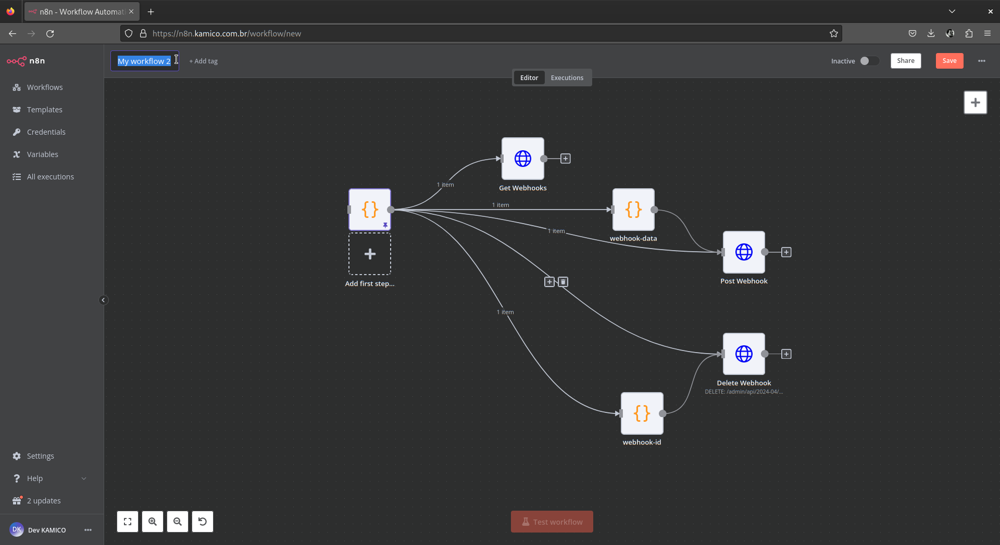
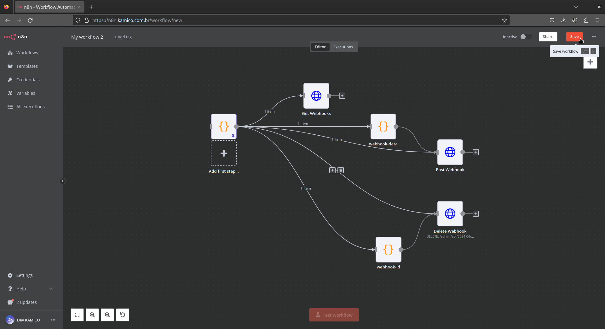

# Shopify Webhooks Management [PT](gerenciamento_de_webhooks_shopify.md) | [EN](gerenciamento_webhooks_shopify-en_us.md)

This document describes how to import and use the [Shopify Webhooks Management](../../../modules/ecomm/gerenciamento_de_webhooks_shopify.json) workflow in N8N to manage webhooks for a Shopify store.

## Importing and Using the Workflow in N8N

### Importing the Workflow

1. **Import** [gerenciamento_webhooks_shopify.json](../../../modules/ecomm/gerenciamento_webhooks_shopify.json) file stored in `modules/ecomm/` folder in this project as mentioned in [Basic Workflow Management Operations](../../../README.md#basic-workflow-management-operations) section on this project README.
2. **Name** the workflow as you prefer.
3. **Save** it and then the workflow will appear in your list of workflows.


*Caption: Name Imported Workflow.*


*Caption: Save Imported Workflow.*

### Setting Up Environment Variables

1. **Update** the API credentials for Shopify by editing the `env-vars` node as mentioned in [Basic Workflow Management Operations](../../../README.md#basic-workflow-management-operations) section on this project README.

    ```javascript
    const env_vars = {
      "shop_url": "https://your_shopify_store.myshopify.com",
      "test_url": "https://your_test_shopify_store.myshopify.com",
    };
    ```

2. **Save the changes.**

### Searching for Webhooks

1. **Configure** the `Get Webhooks` node with the following settings:
    - **Authentication:** Predefined Credential Type
    - **Node Credential Type:** Shopify Access Token API
    - **URL:** `={{ $json.shop_url }}/admin/api/2024-04/webhooks.json`
2. **Save** the node configuration.

### Inserting a Webhook

1. **Configure** the `webhook-data` node to prepare the webhook data to be inserted:

    ```javascript
    const webhookData = {
      "address": "https://your_shopify_store.myshopify.com/webhook/endpoint",
      "topic": "checkout/update",
      "format": "json"
    };
    return { json: webhookData };
    ```

2. **Configure** the `Post Webhook` node with the following settings:
    - **Authentication:** Predefined Credential Type
    - **Node Credential Type:** Shopify Access Token API
    - **Request Method:** POST
    - **URL:** `={{ $json.shop_url }}/admin/api/2024-04/webhooks.json`
    - **Body Parameters:** Use the output from `webhook-data` node.
3. **Save** the node configuration.

### Deleting a Webhook

1. **Configure** the `webhook-id` node to provide the ID of the webhook to be deleted:

    ```javascript
    const webhookID = "your_webhook_id_to_delete";
    return { json: {webhookID: webhookID} };
    ```

2. **Configure** the `Delete Webhook` node with the following settings:
    - **Authentication:** Predefined Credential Type
    - **Node Credential Type:** Shopify Access Token API
    - **Request Method:** DELETE
    - **URL:** `={{ $('env-vars').first().json.shop_url }}/admin/api/2024-04/webhooks/{{ $('webhook-id').first().json.webhookID }}.json`
3. **Save** the node configuration.

### API Documentation References

- [Webhook Shopify API Documentation](https://shopify.dev/docs/api/admin-rest/2024-04/resources/webhook)
- [Webhook Shopify Apps](https://shopify.dev/docs/apps/build/webhooks)
