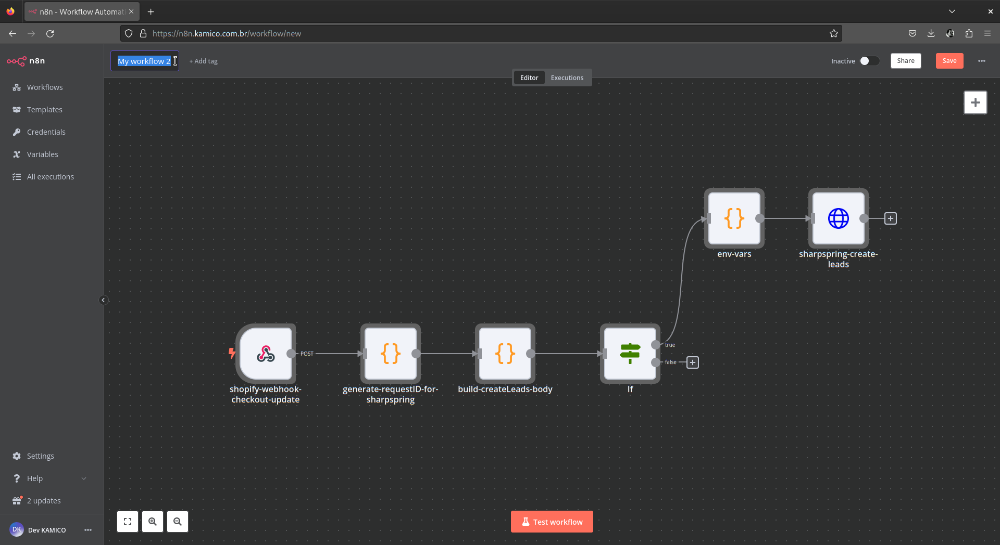
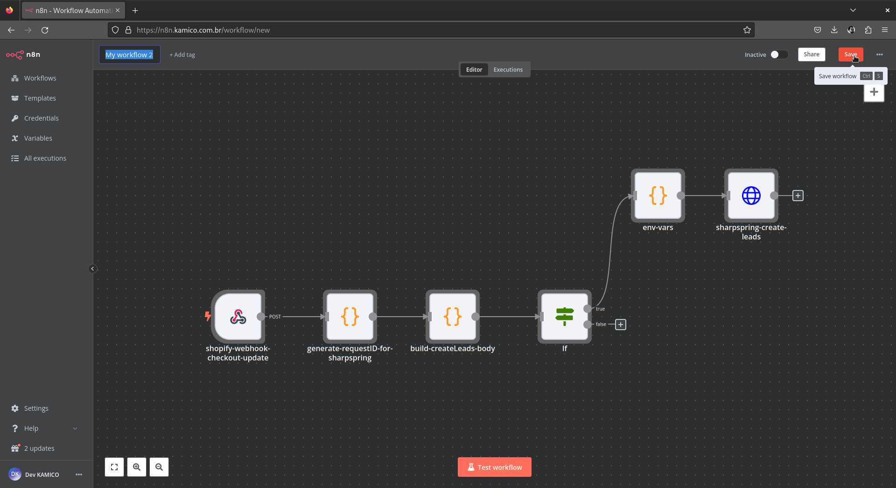

# New Leads - Brand 958 Shopify to SharpSpring [PT](novos_leads_marca_958_shopify_sharpspring.md) | [EN](novos_leads_marca_958_shopify_sharpspring-en_us.md)

This document describes how to import and use the [Novos Leads - Marca 958 Shopify to SharpSpring](../../../modules/ecomm/novos_leads_marca_958_shopify_sharpspring.json) workflow in N8N to automate the creation of new leads in SharpSpring based on Shopify checkout data.

## Importing and Using the Workflow in N8N

### Importing the Workflow

1. **Import** [novos_leads_marca_958_shopify_sharpspring.json](../../../modules/ecomm/novos_leads_marca_958_shopify_sharpspring.json) file stored in `modules/ecomm/` folder in this project as mentioned in [Basic Workflow Management Operations](../../../README.md#basic-workflow-management-operations) section on this project README.
2. **Name** the workflow as you prefer.
3. **Save** it and then the workflow will appear in your list of workflows.


*Caption: Name Imported Workflow.*


*Caption: Save Imported Workflow.*

### Setting Up Environment Variables

1. **Update** the API credentials for SharpSpring by editing the `env-vars` node as mentioned in [Basic Workflow Management Operations](../../../README.md#basic-workflow-management-operations) section on this project README.

    ```javascript
    const apis_credentials = {
      "sharpspring": {
        "url": "http://api.sharpspring.com/pubapi/v1",
        "account_id": "your_sharpspring_account_id",
        "secret_key": "your_sharpspring_secret_key",
      },
    };
    ```

2. **Save the changes.**

### Triggering the Workflow

1. **Configure** the `shopify-webhook-checkout-update` node with the following settings:
    - **HTTP Method:** POST
    - **Path:** `b40202a8-fdd9-463f-b0e6-8bcb676df660`
    - **Options:** Default options
2. **Save** the node configuration.

### Generating a Request ID and Extracting Checkout Data

1. **Configure** the `generate-requestID-for-sharpspring` node to generate a unique request ID and extract checkout data:

    ```javascript
    function generateRandomID() {
        const characters = 'abcdefghijklmnopqrstuvwxyz0123456789';
        const generateGroup = () => {
            let group = '';
            for (let i = 0; i < 6; i++) {
                group += characters.charAt(Math.floor(Math.random() * characters.length));
            }
            return group;
        };
        return `${generateGroup()}-${generateGroup()}-${generateGroup()}-${generateGroup()}`;
    }
    const checkoutData = $('shopify-webhook-checkout-update').first().json
    return { json: {
      requestID: generateRandomID(),
      checkoutData: checkoutData
    } };
    ```

2. **Save** the node configuration.

### Building the Request Body for Creating Leads in SharpSpring

1. **Configure** the `build-createLeads-body` node to build the request body for creating leads:

    ```javascript
    const requestID = $('generate-requestID-for-sharpspring').first().json.requestID;

    const {
      email,
      default_address,
      billing_address,
      phone,
      created_at,
      total_price
    } = $('generate-requestID-for-sharpspring').first().json.checkoutData.body;

    const address = default_address || billing_address || {};

    // Check if essential fields are filled
    const hasEssentialFields =  address.first_name && address.address1 && address.city && address.zip && address.country && (phone || email);

    if (!hasEssentialFields) {
        return [{ json: { message: 'Essential fields missing. No lead created.' } }];
    }

    const leadData = {
      isCustomer: true,
      emailAddress: email || null,
      firstName: address?.first_name || null,
      lastName: address?.last_name || null,
      phoneNumber: phone || null,
      street: address?.address1 || null,
      city: address?.city || null,
      state: address?.province || null,
      zipcode: address?.zip || null,
      country: address?.country || null,
      companyName: address?.company || null,  
      status: 3,
      createTimestamp: new Date(created_at).toISOString(),
      description: `Shopify Checkout created on ${created_at} with total price ${total_price}`    
    };

    return [{ 
      json: {
        method: "createLeads",
        params: { objects: [leadData] },
        id: requestID
      } 
    }];
    ```

2. **Save** the node configuration.

### Conditional Check for Lead Creation

1. **Configure** the `If` node to check if the lead creation request should be sent to SharpSpring:

    ```json
    {
      "conditions": {
        "options": {
          "caseSensitive": true,
          "leftValue": "",
          "typeValidation": "strict"
        },
        "conditions": [
          {
            "id": "0af0cd38-b666-452b-a67a-114a696d2b13",
            "leftValue": "={{ $json.method }}",
            "rightValue": "createLeads",
            "operator": {
              "type": "string",
              "operation": "exists",
              "singleValue": true
            }
          },
          {
            "id": "92960aa0-fe7f-480a-aa69-ede6bab0abb3",
            "leftValue": "={{ $json.method }}",
            "rightValue": "createLeads",
            "operator": {
              "type": "string",
              "operation": "equals",
              "name": "filter.operator.equals"
            }
          },
          {
            "id": "961324ec-e584-4a50-9d89-12c291e120de",
            "leftValue": "={{ $json.params.objects }}",
            "rightValue": "",
            "operator": {
              "type": "array",
              "operation": "notEmpty",
              "singleValue": true
            }
          }
        ],
        "combinator": "and"
      },
      "options": {}
    }
    ```

2. **Save** the node configuration.

### Creating Leads in SharpSpring

1. **Configure** the `sharpspring-create-leads` node to send the lead creation request to SharpSpring:
    - **Method:** POST
    - **URL:** `={{ $('env-vars').first().json.env_vars.apis_credentials.sharpspring.url }}`
    - **Query Parameters:** Use the output from `env-vars` node.
    - **Headers:**
        - Content-Type: application/json
    - **Body:** Use the output from `build-createLeads-body` node.
2. **Save** the node configuration.

### Testing the Workflow

1. Navigate to the workflow settings and **trigger** the `test workflow` button.

2. Check the **execution logs** to verify the workflow's behavior as mentioned in [Basic Workflow Management Operations](../../../README.md#basic-workflow-management-operations) section on this project README.

### Activating the Workflow

After successful testing, switch the workflow to 'Active' mode as mentioned in [Basic Workflow Management Operations](../../../README.md#basic-workflow-management-operations) section on this project README.

### API Documentation References

- [SharpSpring API Documentation](https://api.sharpspring.com/)
- [Shopify API Documentation](https://shopify.dev/docs/api/admin-rest/2024-04)
- [Shopify Apps](https://shopify.dev/docs/apps/)