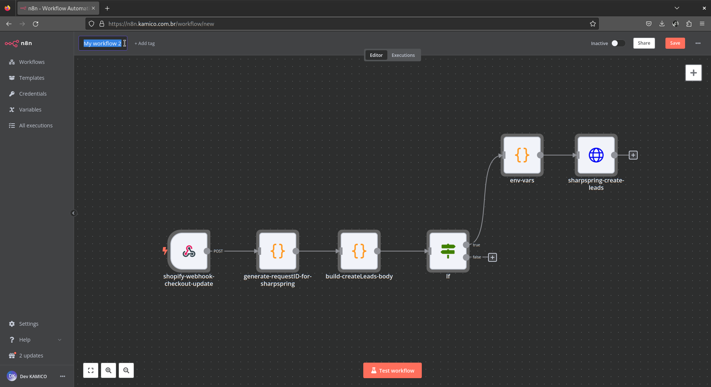
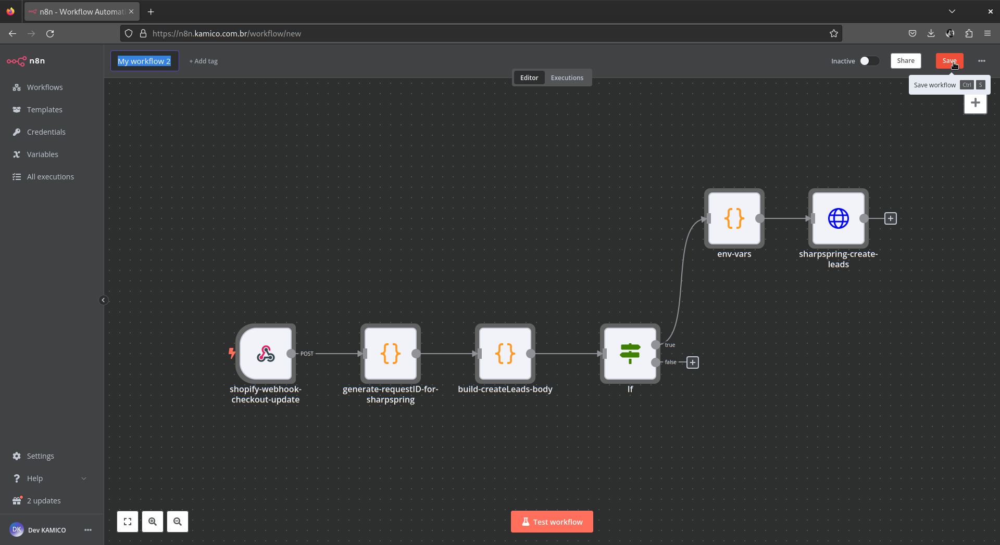

# Novos Leads - Marca 958 Shopify para SharpSpring [PT](novos_leads_marca_958_shopify_sharpspring.md) | [EN](novos_leads_marca_958_shopify_sharpspring-en_us.md)

Este documento descreve como importar e usar o workflow [Novos Leads - Marca 958 Shopify para SharpSpring](../../../modules/ecomm/novos_leads_marca_958_shopify_sharpspring.json) no N8N para automatizar a criação de novos leads no SharpSpring com base nos dados de checkout do Shopify.

## Importando e Usando o Workflow no N8N

### Importando o Workflow

1. **Importe** o arquivo [novos_leads_marca_958_shopify_sharpspring.json](../../../modules/ecomm/novos_leads_marca_958_shopify_sharpspring.json) armazenado na pasta `modules/ecomm/` deste projeto, conforme mencionado na seção [Operações Básicas de Gerenciamento de Workflow](../../../README.md#basic-workflow-management-operations) do README deste projeto.
2. **Nomeie** o workflow como preferir.
3. **Salve** e o workflow aparecerá na sua lista de workflows.


*Legenda: Nomear Workflow Importado.*


*Legenda: Salvar Workflow Importado.*

### Configurando Variáveis de Ambiente

1. **Atualize** as credenciais da API do SharpSpring editando o nó `env-vars` conforme mencionado na seção [Operações Básicas de Gerenciamento de Workflow](../../../README.md#basic-workflow-management-operations) do README deste projeto.

    ```javascript
    const apis_credentials = {
      "sharpspring": {
        "url": "http://api.sharpspring.com/pubapi/v1",
        "account_id": "your_sharpspring_account_id",
        "secret_key": "your_sharpspring_secret_key",
      },
    };
    ```

2. **Salve as alterações.**

### Disparando o Workflow

1. **Configure** o nó `shopify-webhook-checkout-update` com as seguintes configurações:
    - **Método HTTP:** POST
    - **Caminho:** `b40202a8-fdd9-463f-b0e6-8bcb676df660`
    - **Opções:** Opções padrão
2. **Salve** a configuração do nó.

### Gerando um ID de Requisição e Extraindo Dados de Checkout

1. **Configure** o nó `generate-requestID-for-sharpspring` para gerar um ID de requisição único e extrair os dados de checkout:

    ```javascript
    function generateRandomID() {
        const characters = 'abcdefghijklmnopqrstuvwxyz0123456789';
        const generateGroup = () => {
            let group = '';
            for (let i = 0; i < 6; i++) {
                group += characters.charAt(Math.floor(Math.random() * characters.length));
            }
            return group;
        };
        return `${generateGroup()}-${generateGroup()}-${generateGroup()}-${generateGroup()}`;
    }
    const checkoutData = $('shopify-webhook-checkout-update').first().json
    return { json: {
      requestID: generateRandomID(),
      checkoutData: checkoutData
    } };
    ```

2. **Salve** a configuração do nó.

### Construindo o Corpo da Requisição para Criar Leads no SharpSpring

1. **Configure** o nó `build-createLeads-body` para construir o corpo da requisição para criar leads:

    ```javascript
    const requestID = $('generate-requestID-for-sharpspring').first().json.requestID;

    const {
      email,
      default_address,
      billing_address,
      phone,
      created_at,
      total_price
    } = $('generate-requestID-for-sharpspring').first().json.checkoutData.body;

    const address = default_address || billing_address || {};

    // Verifica se os campos essenciais estão preenchidos
    const hasEssentialFields =  address.first_name && address.address1 && address.city && address.zip && address.country && (phone || email);

    if (!hasEssentialFields) {
        return [{ json: { message: 'Essential fields missing. No lead created.' } }];
    }

    const leadData = {
      isCustomer: true,
      emailAddress: email || null,
      firstName: address?.first_name || null,
      lastName: address?.last_name || null,
      phoneNumber: phone || null,
      street: address?.address1 || null,
      city: address?.city || null,
      state: address?.province || null,
      zipcode: address?.zip || null,
      country: address?.country || null,
      companyName: address?.company || null,  
      status: 3,
      createTimestamp: new Date(created_at).toISOString(),
      description: `Shopify Checkout created on ${created_at} with total price ${total_price}`    
    };

    return [{ 
      json: {
        method: "createLeads",
        params: { objects: [leadData] },
        id: requestID
      } 
    }];
    ```

2. **Salve** a configuração do nó.

### Verificação Condicional para Criação de Leads

1. **Configure** o nó `If` para verificar se a requisição de criação de leads deve ser enviada para o SharpSpring:

    ```json
    {
      "conditions": {
        "options": {
          "caseSensitive": true,
          "leftValue": "",
          "typeValidation": "strict"
        },
        "conditions": [
          {
            "id": "0af0cd38-b666-452b-a67a-114a696d2b13",
            "leftValue": "={{ $json.method }}",
            "rightValue": "createLeads",
            "operator": {
              "type": "string",
              "operation": "exists",
              "singleValue": true
            }
          },
          {
            "id": "92960aa0-fe7f-480a-aa69-ede6bab0abb3",
            "leftValue": "={{ $json.method }}",
            "rightValue": "createLeads",
            "operator": {
              "type": "string",
              "operation": "equals",
              "name": "filter.operator.equals"
            }
          },
          {
            "id": "961324ec-e584-4a50-9d89-12c291e120de",
            "leftValue": "={{ $json.params.objects }}",
            "rightValue": "",
            "operator": {
              "type": "array",
              "operation": "notEmpty",
              "singleValue": true
            }
          }
        ],
        "combinator": "and"
      },
      "options": {}
    }
    ```

2. **Salve** a configuração do nó.

### Criando Leads no SharpSpring

1. **Configure** o nó `sharpspring-create-leads` para enviar a requisição de criação de leads para o SharpSpring:
    - **Método:** POST
    - **URL:** `={{ $('env-vars').first().json.env_vars.apis_credentials.sharpspring.url }}`
    - **Parâmetros de Consulta:** Use a saída do nó `env-vars`.
    - **Cabeçalhos:**
        - Content-Type: application/json
    - **Corpo:** Use a saída do nó `build-createLeads-body`.
2. **Salve** a configuração do nó.

### Testando o Workflow

1. Navegue até as configurações do workflow e **dispare** o botão `test workflow`.

2. Verifique os **logs de execução** para verificar o comportamento do workflow conforme mencionado na seção [Operações Básicas de Gerenciamento de Workflow](../../../README.md#basic-workflow-management-operations) do README deste projeto.

### Ativando o Workflow

Após testes bem-sucedidos, alterne o workflow para o modo 'Ativo' conforme mencionado na seção [Operações Básicas de Gerenciamento de Workflow](../../../README.md#basic-workflow-management-operations) do README deste projeto.

### Referências da Documentação da API

- [Documentação da API SharpSpring](https://api.sharpspring.com/)
- [Documentação da API Shopify](https://shopify.dev/docs/api/admin-rest/2024-04)
- [Shopify Apps](https://shopify.dev/docs/apps/)