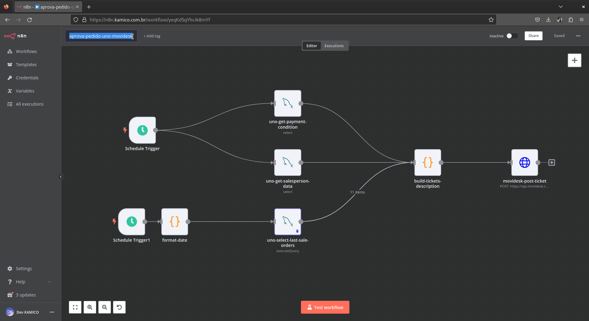
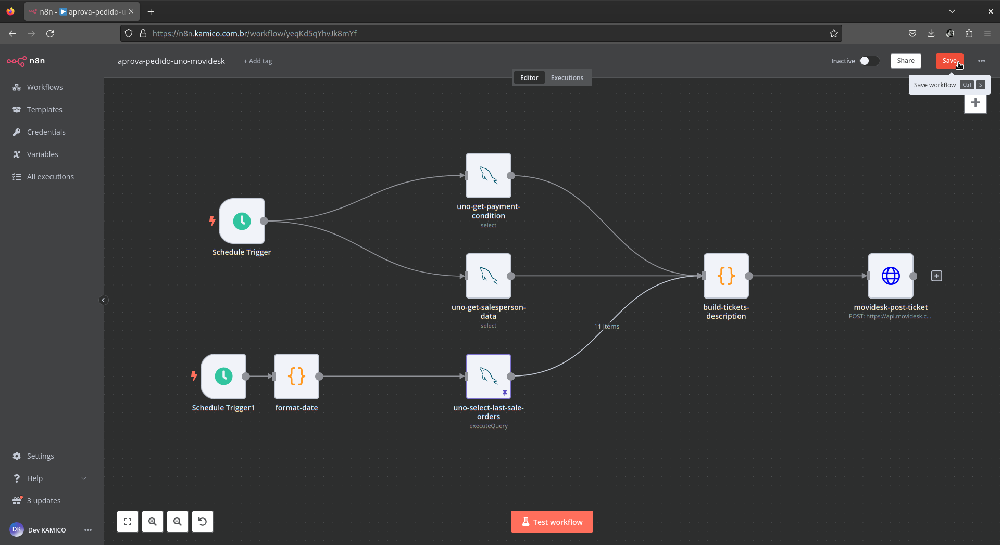
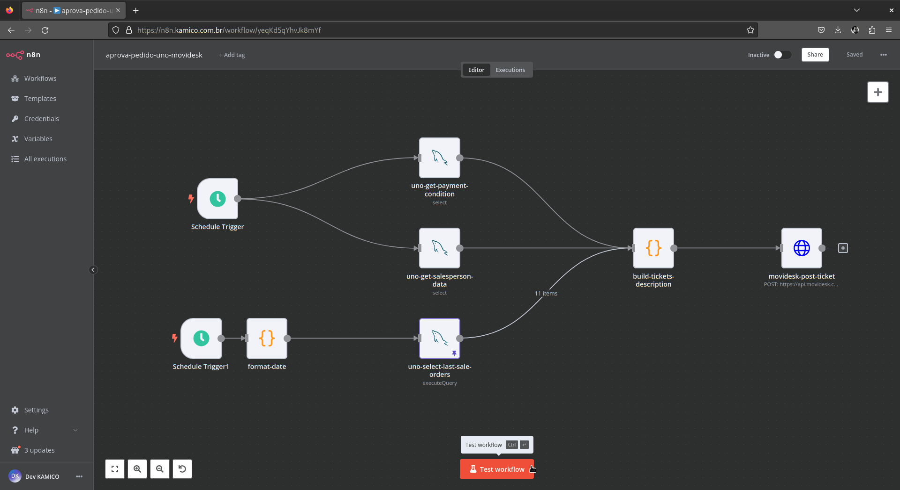

# Aprovação de Pedido UNO Movidesk Workflow [PT](aprova_pedido_uno_movidesk.md) | [EN](aprova_pedido_uno_movidesk-en_us.md)

O fluxo de trabalho de Aprovação de Pedido integra o ERP UNO com o sistema de gestão de atendimento Movidesk para automatizar processos de aprovação de pedidos. Este documento descreve como importar e usar o fluxo de trabalho [Aprovação de Pedido UNO Movidesk](../../../modules/sales/aprova_pedido_uno_movidesk.json) no N8N.

## Importando e Usando o Fluxo de Trabalho no N8N

### Importando o Fluxo de Trabalho

1. **Importar** [aprova_pedido_uno_movidesk.json](../../../modules/sales/aprova_pedido_uno_movidesk.json) arquivo armazenado na pasta `modules/sales/` neste projeto, conforme mencionado em [Operações básicas de gerenciamento de fluxo de trabalho](../../../README.md#basic-workflow-management-operations) neste README do projeto.
2. **Nomeie** o fluxo de trabalho como preferir.
3. **Salve** e o fluxo de trabalho aparecerá na sua lista de fluxos de trabalho.


*Legenda: Nome do fluxo de trabalho importado.*


*Legenda: Salvar fluxo de trabalho importado.*

### Configurando Variáveis de Ambiente

1. **Atualize** as credenciais da API da UNO e Movidesk, editando o nó `env-vars` conforme mencionado em [Operações básicas de gerenciamento de fluxo de trabalho](../../../README.md#basic-workflow-management-operations) neste README do projeto.

    ```javascript
    const apis_credentials = {
      "uno": {
        "url": "http://api.unoerp.com.br/v1",
        "account_id": "seu_id_de_conta_uno",
        "secret_key": "sua_chave_secreta_uno",
      },
      "movidesk": {
        "url": "https://api.movidesk.com/public/v1",
        "token": "seu_token_movidesk",
      },
    };
    ```

2. **Salve as alterações.**

### Testando o Fluxo de Trabalho

1. Navegue até as configurações do fluxo de trabalho e **acione** o botão `test workflow`.

    
    *Legenda: Acionando manualmente o fluxo de trabalho para teste.*

2. Verifique os **logs de execução** para verificar o comportamento do fluxo de trabalho, conforme mencionado em [Operações básicas de gerenciamento de fluxo de trabalho](../../../README.md#basic-workflow-management-operations) neste README do projeto.

### Ativando o Fluxo de Trabalho

Após o teste bem-sucedido, mude o fluxo de trabalho para o modo 'Ativo' conforme mencionado em [Operações básicas de gerenciamento de fluxo de trabalho](../../../README.md#basic-workflow-management-operations) neste README do projeto.

### Referências da Documentação da API

- [Documentação da API ERP UNO](https://unoerp.com.br/)
- [Documentação da API Movidesk para Tickets](https://support.movidesk.com/kb/pt-br/article/161485/tickets-api)
